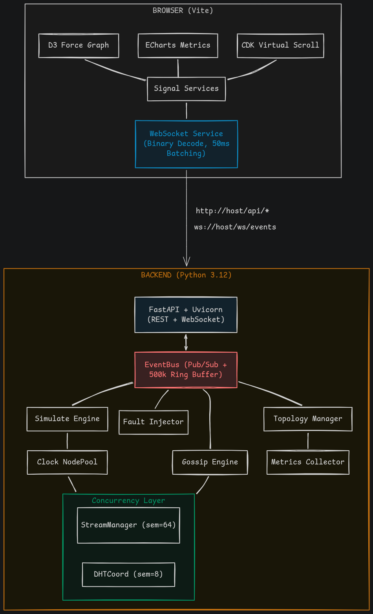
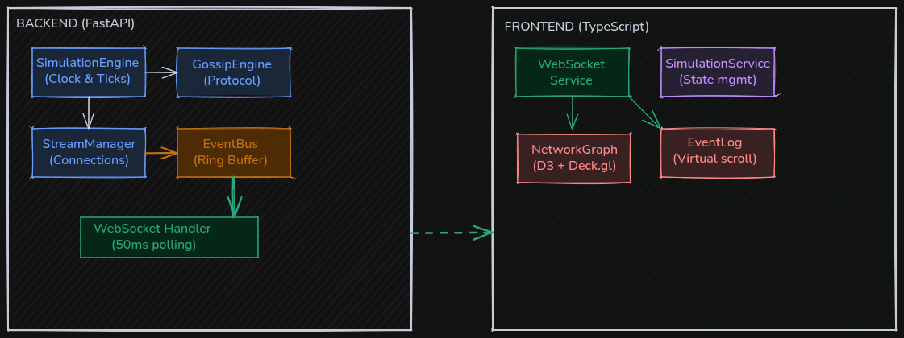

# 3. System Architecture

## 3.1 High-Level Overview

Luminar follows a **client-server architecture** with an event-sourced backend and a reactive frontend. All P2P simulation happens server-side; the frontend is a pure visualization layer.

  

## 3.2 Data Flow

### Event Flow (Backend → Frontend)

  

## 3.4 Communication Protocols

### REST API
- **Purpose**: User-initiated actions (play, pause, inject fault, apply topology)
- **Format**: JSON request/response
- **Endpoints**: 30+ across 7 route groups
- **Proxy**: Angular dev server proxies `/api/*` to `http://localhost:8000`

### WebSocket
- **Purpose**: Real-time event streaming (backend → frontend)
- **Format**: Binary (orjson bytes → ArrayBuffer)
- **Endpoint**: `/ws/events`
- **Frequency**: 50ms poll batches (20 Hz)
- **Reconnect**: 2 second auto-reconnect on disconnect

### Why Single WebSocket?
A single WebSocket connection carries all event types. The frontend filters client-side. This design:
- Reduces connection overhead (one TCP connection vs. many)
- Simplifies server-side fan-out (one subscriber per client)
- Enables unified event ordering (total order across all event types)
- Makes replay straightforward (single event stream to record/replay)